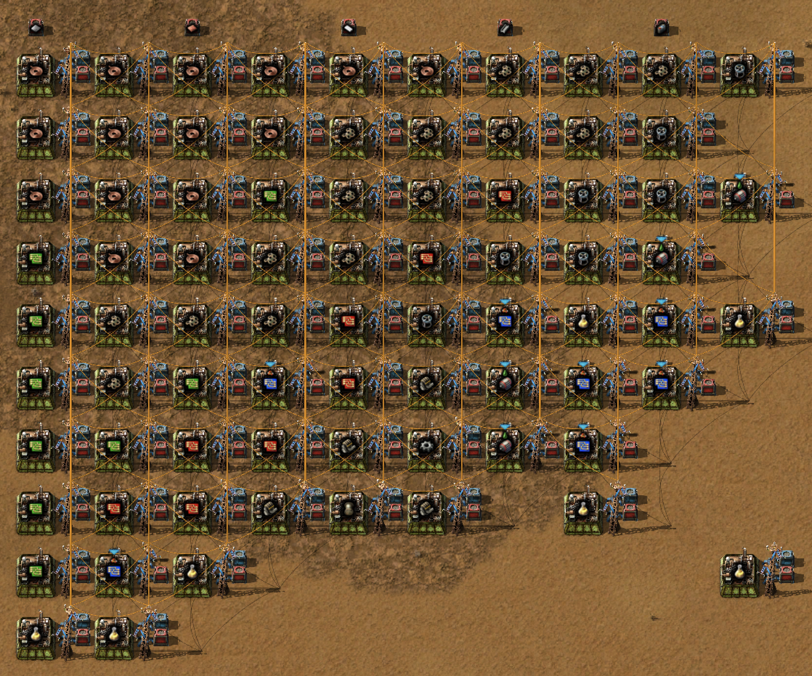
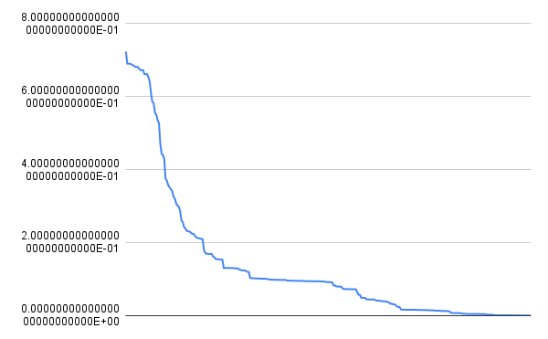
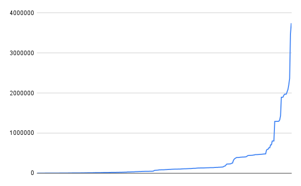

# Factorio solver 
***(quick look, unfinished readme.md / docs)***

This project applies constraint programming to the factory layout problem in Factorio. It employs Google's CP-SAT solver to determine an optimal, two-dimensional layout for a bot-based production mall.

The problem is modeled as a mathematical optimization problem. The primary objective is the minimization of total transportation cost, calculated using the Manhattan distance.

The system considers input resource location (can be multiple per single resource), special placement of set recipes. Distance is measured by Manhattan metric, and volume of items to transport.

## Example layout

this is the output, rendered as a complete, importable blueprint. This includes recipes, and requester chests. This is equivalent to 60 items per minute of utility science pack (times assembler speed)

## Closer look

### Gradually finding better layouts
[final_video_1000w3.mp4](figures/final_video_1000w3.mp4)
(1–305 solutions, was stopped prematurely)

### Layout improvements per new solution

### Time taken total per new solution (in ms)

