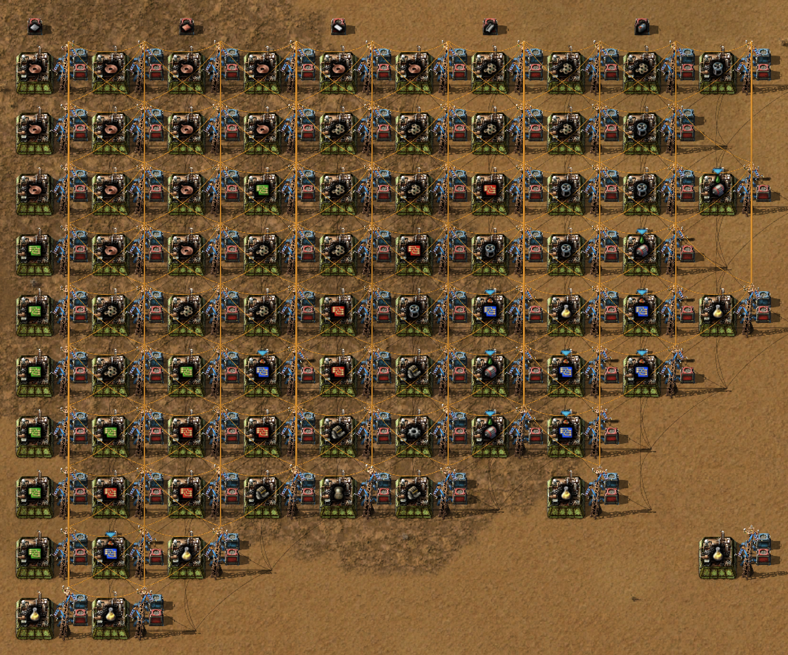
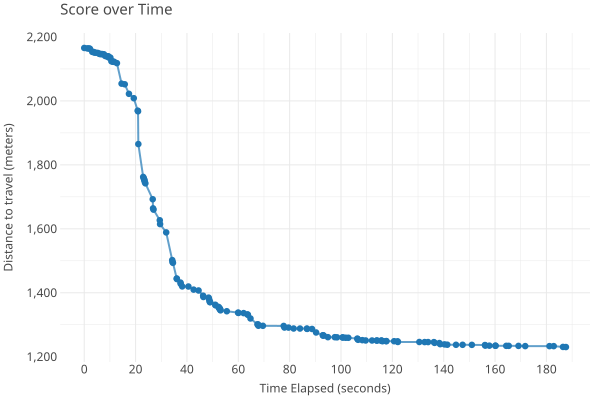

# Factorio solver 
***(quick look, unfinished readme.md / docs)***

This project applies constraint programming to the factory layout problem in Factorio. It employs Google's CP-SAT solver to determine an optimal, two-dimensional layout for a bot-based production mall.

The problem is modeled as a mathematical optimization problem. The primary objective is the minimization of total transportation cost, calculated using the Manhattan distance.

The system considers input resource location (can be multiple per single resource), special placement of set recipes. Distance is measured by Manhattan metric, and volume of items to transport.

## Example layout


this is the output, rendered as a complete, importable blueprint. This includes recipes, and requester chests. This is equivalent to 60 items per minute of utility science pack (times assembler speed)

# How to run
This project requires Java 17 or newer. Java 21 is the supported runtime in the
current development container.

If Java 21 is not installed, install it with SDKMAN:

```sh
sdk install java 21.0.12+1-ms
sdk default java 21.0.12+1-ms
```

Verify the active Java version, then run the application:

```sh
java -version
./gradlew run
```

Before running, specify recipes and input sources. If source locations are not
set, the system will not account for those distances. Output files are written
to `src/main/resources/solves/`.

## Closer look and statistics

### Gradually finding better layouts
[final_video_1000w3.mp4](figures/final_video_1000w3.mp4)
(1–305 solutions, was stopped prematurely)

### Layout improvements per new solution


